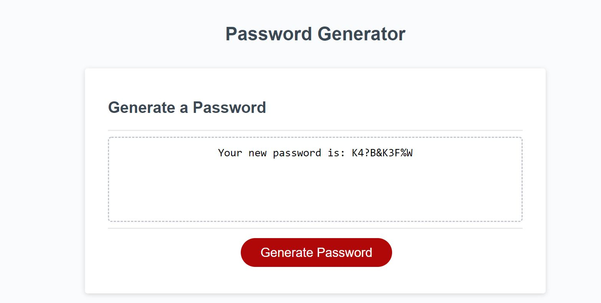

## Password Generator

## Project Scope

This project involved producing a webpage that generates a random password for the user.  The password generator will produce a password with requirements that meet certain user-identified criteria.  The criteria includes selecting a password length between 8 to 128 characters, and the possible inclusion of either lowercase letters, uppercase letters, numbers, and/or special characters.  After the user has specified these options, then the password generater will print the new password into the main body section within the center of the window screen.  The project is also designed to have a clean and responsive user interface.

## Webpage image and link

The following image shows the web application's appearance and functionality:

This [link](https://bmavetz.github.io/Password-Generator/) link will direct you to the active webpage containing the password generator.
![link]

